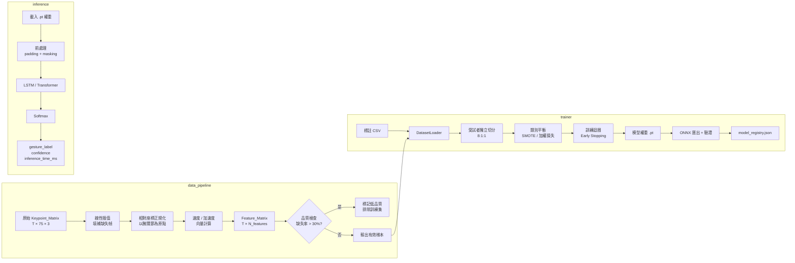

# 設計文件：sign-language-ai-communication（ai_model/ 模組）

> 本文件聚焦於資工A負責的 `ai_model/` 核心 AI 模型訓練管線，並定義與其他模組（`signal_processing/`、`frontend/`）的介面邊界。

---

## 概覽（Overview）

SignVox-AI 的 `ai_model/` 模組是整個 S2S（手語轉語音）管線的核心，負責：

1. **資料前處理**：將 MediaPipe 輸出的原始關節點座標轉換為可訓練的特徵矩陣
2. **模型訓練**：提供 LSTM 與輕量化 Transformer 兩種架構的訓練管線
3. **模型管理**：版本控制、ONNX 匯出、實驗追蹤
4. **推論服務**：提供標準化 Python API 供前端模組呼叫

### 設計原則

- **邊緣優先**：所有推論在本地端完成，不依賴雲端
- **模組解耦**：`inference/` 作為唯一對外介面，內部實作對外部透明
- **可重現性**：所有實驗透過 YAML 設定檔與隨機種子完整記錄
- **雙架構支援**：LSTM 與 Transformer 共用同一訓練管線，透過設定檔切換

---

## 架構（Architecture）

### 系統整體架構（High-Level）

```mermaid
graph TD
    CAM[Web Camera] --> MP[MediaPipe<br/>Landmark Extractor]
    MP -->|Keypoint_Matrix<br/>[T, 75, 3]| SP[signal_processing/<br/>卡爾曼濾波 + 滑動視窗]
    SP -->|Filtered Keypoint_Matrix<br/>[T, 75, 3]| DP[ai_model/data_pipeline<br/>特徵萃取 + 正規化]
    DP -->|Feature_Matrix<br/>[T, N_features]| INF[ai_model/inference<br/>Inference API]
    INF -->|gesture_label + confidence| FE[frontend/<br/>GUI 顯示]
    INF -->|gesture_label| TTS[TTS Engine<br/>語音合成]

    subgraph ai_model
        DP
        MODELS[models/<br/>LSTM / Transformer]
        TRAINER[trainer/<br/>訓練管線]
        INF
        CONFIGS[configs/<br/>YAML 設定檔]
        EXP[experiments/<br/>模型版本管理]
    end

    TRAINER -->|訓練完成| EXP
    EXP -->|載入權重| INF
    CONFIGS --> TRAINER
    CONFIGS --> MODELS
    MODELS --> TRAINER
    MODELS --> INF
```

### ai_model/ 子模組資料流（Low-Level）



---

## 元件與介面（Components and Interfaces）

### 1. data_pipeline/

#### `preprocessor.py`

```python
class KeypointPreprocessor:
    """
    將原始 Keypoint_Matrix 轉換為訓練用特徵矩陣。
    輸入：[T, N_joints, 3]（N_joints = 75：左手21 + 右手21 + 姿態33）
    輸出：[T, N_features]（N_features = 75*3 座標 + 75*3 速度 + 75*3 加速度 = 675）
    """

    def __init__(self, missing_threshold: float = 0.3):
        self.missing_threshold = missing_threshold

    def fit_transform(
        self,
        keypoint_matrix: np.ndarray  # shape: [T, 75, 3]
    ) -> tuple[np.ndarray, dict]:
        """
        回傳 (feature_matrix, metadata)
        metadata 包含 missing_ratio、is_valid、fill_count
        """
        ...

    def _interpolate_missing(
        self,
        matrix: np.ndarray  # shape: [T, 75, 3]
    ) -> tuple[np.ndarray, float]:
        """線性插值填補 NaN/零值，回傳 (filled_matrix, missing_ratio)"""
        ...

    def _normalize_to_wrist(
        self,
        matrix: np.ndarray  # shape: [T, 75, 3]
    ) -> np.ndarray:
        """以腕關節（index 0）為原點進行相對座標轉換"""
        ...

    def _compute_velocity_acceleration(
        self,
        coords: np.ndarray  # shape: [T, 75, 3]
    ) -> np.ndarray:
        """計算速度與加速度向量，回傳 [T, 75, 9]（座標+速度+加速度）"""
        ...

    def serialize(self, feature_matrix: np.ndarray, path: str) -> None:
        """序列化特徵矩陣為 .npy 格式"""
        ...

    def deserialize(self, path: str) -> np.ndarray:
        """從 .npy 格式還原特徵矩陣，格式不符時拋出 ValueError"""
        ...
```

#### `dataset.py`

```python
class GestureDataset(torch.utils.data.Dataset):
    """
    PyTorch Dataset，支援可變長度序列的 padding 與 masking。
    """

    def __init__(
        self,
        feature_dir: str,
        annotation_csv: str,
        max_seq_len: int = 150,
        augment: bool = False
    ):
        ...

    def __getitem__(self, idx: int) -> dict:
        """
        回傳 {
            'features': Tensor[T, N_features],
            'label': int,
            'mask': Tensor[T],  # 1=有效, 0=padding
            'sample_id': str
        }
        """
        ...

    @staticmethod
    def collate_fn(batch: list[dict]) -> dict:
        """動態 padding 至批次內最長序列"""
        ...
```

---

### 2. models/

#### `lstm_classifier.py`

```python
class BiLSTMClassifier(nn.Module):
    """
    雙層雙向 LSTM 手語分類器。

    架構：
        Input [B, T, N_features=675]
        → Linear Projection [B, T, input_dim]
        → BiLSTM Layer 1 [B, T, hidden_dim*2]  (hidden_dim=256)
        → Dropout(0.3)
        → BiLSTM Layer 2 [B, T, hidden_dim*2]
        → Dropout(0.3)
        → Masked Mean Pooling [B, hidden_dim*2]
        → Linear [B, num_classes]
        → Softmax → Confidence_Score [B, num_classes]

    參數量估算（hidden=256, num_classes=100）：
        Layer1: 4 * (675+256) * 256 * 2 ≈ 1.9M
        Layer2: 4 * (512+256) * 256 * 2 ≈ 1.6M
        FC: 512 * 100 ≈ 51K
        總計 ≈ 3.6M 參數
    """

    def __init__(
        self,
        input_dim: int = 675,
        hidden_dim: int = 256,
        num_layers: int = 2,
        num_classes: int = 100,
        dropout: float = 0.3
    ):
        ...

    def forward(
        self,
        x: torch.Tensor,       # [B, T, N_features]
        mask: torch.Tensor     # [B, T]，1=有效幀
    ) -> torch.Tensor:         # [B, num_classes]
        ...
```

#### `transformer_classifier.py`

```python
class LightweightTransformerClassifier(nn.Module):
    """
    輕量化 Transformer 手語分類器（≤ 5M 參數）。

    架構：
        Input [B, T, N_features=675]
        → Linear Projection [B, T, d_model=128]
        → Positional Encoding（可學習式）
        → TransformerEncoder × 4 層
            每層：MultiHeadAttention(heads=4, d_k=32) + FFN(d_ff=256)
        → CLS Token Pooling [B, d_model]
        → Linear [B, num_classes]
        → Softmax → Confidence_Score [B, num_classes]

    參數量估算（d_model=128, heads=4, layers=4, num_classes=100）：
        Projection: 675*128 ≈ 86K
        Per Layer: Attn(128*128*4) + FFN(128*256*2) ≈ 131K
        4 Layers: ≈ 524K
        CLS + FC: 128*100 ≈ 13K
        總計 ≈ 0.6M 參數（遠低於 5M 上限）
    """

    def __init__(
        self,
        input_dim: int = 675,
        d_model: int = 128,
        num_heads: int = 4,
        num_layers: int = 4,
        d_ff: int = 256,
        num_classes: int = 100,
        dropout: float = 0.1,
        max_seq_len: int = 150
    ):
        ...

    def forward(
        self,
        x: torch.Tensor,       # [B, T, N_features]
        mask: torch.Tensor     # [B, T]，True=padding 位置（需遮蔽）
    ) -> torch.Tensor:         # [B, num_classes]
        ...

class LearnablePositionalEncoding(nn.Module):
    """可學習式位置編碼，形狀 [1, max_seq_len, d_model]"""

    def __init__(self, d_model: int, max_seq_len: int = 150):
        ...

    def forward(self, x: torch.Tensor) -> torch.Tensor:
        ...
```

---

### 3. trainer/

#### `train.py`

```python
class GestureTrainer:
    """
    統一訓練管線，支援 LSTM 與 Transformer 架構切換。
    """

    def __init__(self, config_path: str):
        """從 YAML 設定檔載入所有超參數"""
        ...

    def setup(self) -> None:
        """初始化資料集、模型、優化器、排程器"""
        ...

    def train(self) -> dict:
        """
        執行完整訓練迴圈，回傳最終指標摘要。
        包含：Early Stopping（patience=10）、Cosine Annealing LR
        """
        ...

    def _train_epoch(self, epoch: int) -> dict:
        """單一 epoch 訓練，回傳 {loss, accuracy, f1}"""
        ...

    def _validate(self) -> dict:
        """驗證集評估，回傳 {loss, accuracy, f1, confusion_matrix}"""
        ...

    def save_checkpoint(self, path: str, metrics: dict) -> None:
        """儲存模型權重 + 超參數設定 + 訓練指標"""
        ...

    def export_onnx(self, pt_path: str, onnx_path: str) -> None:
        """匯出 ONNX 並驗證數值一致性（差異 ≤ 1e-5）"""
        ...
```

#### `registry.py`

```python
class ModelRegistry:
    """維護 model_registry.json，追蹤所有實驗版本"""

    def __init__(self, registry_path: str = "experiments/model_registry.json"):
        ...

    def register(
        self,
        experiment_id: str,
        model_path: str,
        onnx_path: str,
        metrics: dict,
        config: dict
    ) -> None:
        ...

    def get_best_model(self, metric: str = "val_accuracy") -> dict:
        """回傳指定指標最佳的模型記錄"""
        ...

    def list_experiments(self) -> list[dict]:
        ...
```

---

### 4. inference/

#### `predictor.py`

```python
class GesturePredictor:
    """
    推論 API，供 frontend/ 呼叫。
    這是 ai_model/ 對外的唯一公開介面。
    """

    def __init__(
        self,
        model_path: str,
        config_path: str,
        device: str = "auto"  # "auto" | "cuda" | "cpu"
    ):
        """
        載入模型權重，初始化時間 ≤ 3 秒。
        device="auto" 時自動偵測 CUDA 可用性。
        """
        ...

    def predict(
        self,
        keypoint_matrix: np.ndarray  # shape: [T, 75, 3]
    ) -> dict:
        """
        單樣本推論。

        回傳：
        {
            "gesture_label": str,        # 手語語意標籤
            "confidence": float,         # 0.0 ~ 1.0
            "inference_time_ms": float,  # 推論耗時（毫秒）
            "timestamp": str,            # ISO 8601 格式
            "keypoint_hash": str         # 輸入資料的 MD5 雜湊
        }

        例外：
            ValueError: 輸入形狀不符合預期時拋出，包含描述性訊息
        """
        ...

    def predict_batch(
        self,
        keypoint_matrices: list[np.ndarray]
    ) -> list[dict]:
        """批次推論，回傳與輸入等長的結果列表"""
        ...

    def serialize_result(self, result: dict) -> str:
        """將推論結果序列化為 JSON 字串"""
        ...

    @staticmethod
    def deserialize_result(json_str: str) -> dict:
        """從 JSON 字串還原推論結果"""
        ...
```

---

### 5. configs/

#### `default_lstm.yaml`（範例）

```yaml
experiment:
  name: "bilstm_baseline"
  seed: 42

model:
  architecture: "lstm"  # "lstm" | "transformer"
  input_dim: 675
  hidden_dim: 256
  num_layers: 2
  num_classes: 100
  dropout: 0.3

training:
  epochs: 100
  batch_size: 32
  learning_rate: 1.0e-3
  weight_decay: 1.0e-4
  early_stopping_patience: 10
  lr_scheduler: "cosine_annealing"
  balance_strategy: "weighted_loss"  # "smote" | "weighted_loss"

data:
  feature_dir: "data/features/"
  annotation_csv: "data/annotations.csv"
  max_seq_len: 150
  train_ratio: 0.8
  val_ratio: 0.1
  test_ratio: 0.1

paths:
  checkpoint_dir: "experiments/checkpoints/"
  log_dir: "experiments/logs/"
  registry: "experiments/model_registry.json"
```

---

## 資料模型（Data Models）

### Keypoint_Matrix（輸入）

| 欄位 | 型別 | 說明 |
|------|------|------|
| shape | `[T, 75, 3]` | T=時間步數（可變），75=關節點數，3=(x,y,z) |
| dtype | `float32` | 正規化至 [0,1] 的螢幕座標 |
| 來源 | `signal_processing/` | 經卡爾曼濾波後的輸出 |

關節點索引配置：
- `[0:21]`：左手 21 個關節點
- `[21:42]`：右手 21 個關節點
- `[42:75]`：身體姿態 33 個關節點
- 腕關節索引：左手=0，右手=21

### Feature_Matrix（中間表示）

| 欄位 | 型別 | 說明 |
|------|------|------|
| shape | `[T, 675]` | 675 = 75關節 × (3座標 + 3速度 + 3加速度) |
| dtype | `float32` | 相對座標（以腕關節為原點） |

### 標註 CSV 格式

| 欄位 | 型別 | 說明 |
|------|------|------|
| `sample_id` | `str` | 唯一樣本識別碼 |
| `gesture_label` | `str` | 手語語意標籤 |
| `start_frame` | `int` | 有效手勢起始幀 |
| `end_frame` | `int` | 有效手勢結束幀 |
| `quality_flag` | `int` | 0=低品質，1=正常，2=高品質 |

### model_registry.json 格式

```json
{
  "experiments": [
    {
      "experiment_id": "20250115_143022",
      "architecture": "lstm",
      "training_date": "2025-01-15T14:30:22",
      "val_accuracy": 0.872,
      "val_f1": 0.851,
      "model_path": "experiments/checkpoints/20250115_143022/best_model.pt",
      "onnx_path": "experiments/checkpoints/20250115_143022/model.onnx",
      "config_path": "experiments/checkpoints/20250115_143022/config.yaml"
    }
  ]
}
```

### 推論結果 JSON 格式

```json
{
  "gesture_label": "你好",
  "confidence": 0.923,
  "inference_time_ms": 42.7,
  "timestamp": "2025-01-15T14:30:22.123456",
  "keypoint_hash": "a3f2c1d4e5b6..."
}
```

---

## 與其他模組的介面定義

### 介面一：signal_processing/ → ai_model/data_pipeline/

**方向**：電機模組輸出 → 資工A接收

```python
# 電機模組輸出的資料格式（合約）
filtered_keypoints: np.ndarray  # shape: [T, 75, 3], dtype=float32
# T 為滑動視窗切割後的時間步數（建議 30~150 幀）
# 已完成卡爾曼濾波，但可能仍含少量 NaN（遮擋情況）
```

**約定**：
- 電機模組保證輸出 shape 為 `[T, 75, 3]`
- 資工A的 `KeypointPreprocessor` 負責處理剩餘 NaN
- 介面以 Python 函式呼叫為主（同進程），不需 HTTP

### 介面二：ai_model/inference/ → frontend/

**方向**：資工A提供 → 資工B呼叫

```python
# frontend/ 呼叫方式
from ai_model.inference.predictor import GesturePredictor

predictor = GesturePredictor(
    model_path="experiments/checkpoints/best/best_model.pt",
    config_path="ai_model/configs/default_lstm.yaml"
)

# 單次推論
result = predictor.predict(keypoint_matrix)
# result: {"gesture_label": str, "confidence": float, "inference_time_ms": float, ...}

# 批次推論
results = predictor.predict_batch([km1, km2, km3])
```

**SLA 約定**：
- GPU 環境：`inference_time_ms` ≤ 50ms
- CPU 環境：`inference_time_ms` ≤ 200ms
- 初始化時間 ≤ 3 秒（僅呼叫一次）
- `confidence` 值域保證在 [0.0, 1.0]

---

## 正確性屬性（Correctness Properties）

*屬性（Property）是在系統所有有效執行中都應成立的特性或行為——本質上是對系統應做什麼的形式化陳述。屬性作為人類可讀規格與機器可驗證正確性保證之間的橋樑。*

---

### Property 1：前處理輸出形狀不變量

*對任意* 形狀為 `[T, N_joints, 3]` 的有效 Keypoint_Matrix（T ≥ 2，N_joints = 75），經 `KeypointPreprocessor.fit_transform()` 處理後，輸出特徵矩陣的形狀應為 `[T, 675]`（675 = 75 × 9，包含座標、速度、加速度各 3 維）。

**Validates: Requirements 1.1, 1.5**

---

### Property 2：插值後無缺失值

*對任意* 含有 NaN 或零值（缺失率 ≤ 30%）的 Keypoint_Matrix，經線性插值後，輸出矩陣中不應包含任何 NaN 值，且 `metadata["missing_ratio"]` 應被記錄為非負浮點數。

**Validates: Requirements 1.2**

---

### Property 3：腕關節正規化後座標為零

*對任意* 有效 Keypoint_Matrix，經相對座標正規化後，左手腕關節（index 0）與右手腕關節（index 21）的座標值應為 `(0, 0, 0)`（允許浮點誤差 ≤ 1e-6）。

**Validates: Requirements 1.3**

---

### Property 4：受試者獨立切分不變量

*對任意* 含有多位受試者的資料集，執行 `DatasetLoader` 切分後，應同時滿足：(1) 訓練/驗證/測試集比例接近 8:1:1（允許 ±5% 誤差），(2) 任意受試者的所有樣本只出現在一個集合中（不跨集合）。

**Validates: Requirements 2.3**

---

### Property 5：模型輸出為有效機率分布

*對任意* 形狀為 `[B, T, 675]` 的批次輸入（B ≥ 1，T ≥ 1），LSTM 與 Transformer 分類器的輸出應滿足：(1) 形狀為 `[B, num_classes]`，(2) 每個樣本的所有類別分數加總為 1.0（允許誤差 ≤ 1e-5），(3) 所有分數介於 [0.0, 1.0]。

**Validates: Requirements 3.2, 6.7**

---

### Property 6：可變長度序列的 Padding/Masking 正確性

*對任意* 包含不同長度序列的批次，`GestureDataset.collate_fn` 應將所有序列 padding 至批次內最長長度，且 mask 張量中有效幀標記為 1、padding 幀標記為 0，mask 的形狀應與 features 的前兩維一致。

**Validates: Requirements 3.5**

---

### Property 7：模型可用任意合法設定建立並前向傳播

*對任意* 合法的超參數組合（hidden_dim ∈ [64, 512]、num_heads ∈ {1,2,4,8}、num_layers ∈ [1,6]），LSTM 與 Transformer 模型應能成功建立，並對隨機輸入完成前向傳播而不拋出例外。

**Validates: Requirements 3.1, 4.1**

---

### Property 8：Transformer 參數量上限

*對任意* 合法的 Transformer 設定（d_model ≤ 256，num_heads ≤ 8，num_layers ≤ 6），模型的總參數量應 ≤ 5,000,000。

**Validates: Requirements 4.3**

---

### Property 9：訓練日誌完整性

*對任意* 訓練迴圈的每個 epoch，日誌記錄應包含 `train_loss`、`val_loss`、`accuracy`、`f1_score` 四個欄位，且數值均為有限浮點數（非 NaN、非 Inf）。

**Validates: Requirements 5.2**

---

### Property 10：相同種子的訓練可重現性

*對任意* 相同的 YAML 設定檔與隨機種子，執行兩次訓練的前 N 個 epoch 的訓練損失序列應完全相同（差異 ≤ 1e-6）。

**Validates: Requirements 5.6**

---

### Property 11：推論 API 回傳結構完整性

*對任意* 形狀正確的 Keypoint_Matrix 輸入，`GesturePredictor.predict()` 的回傳字典應包含 `gesture_label`（str）、`confidence`（float，[0,1]）、`inference_time_ms`（float，> 0）、`timestamp`（str）、`keypoint_hash`（str）五個欄位。

**Validates: Requirements 6.1**

---

### Property 12：非法輸入拋出描述性例外

*對任意* 形狀不符合 `[T, 75, 3]` 的輸入（如維度數錯誤、第二維不為 75、dtype 不符），`GesturePredictor.predict()` 應拋出 `ValueError`，且例外訊息應包含實際輸入形狀與預期形狀的描述。

**Validates: Requirements 6.5**

---

### Property 13：批次推論結果數量一致性

*對任意* 長度為 N 的輸入列表，`GesturePredictor.predict_batch()` 的回傳列表長度應等於 N，且每個元素均為包含必要欄位的字典。

**Validates: Requirements 6.6**

---

### Property 14：ONNX 與 PyTorch 數值一致性

*對任意* 有效輸入，同一模型的 ONNX 版本與 PyTorch 版本的輸出差異（L∞ 範數）應 ≤ 1e-5。

**Validates: Requirements 7.3**

---

### Property 15：實驗記錄完整性

*對任意* 完成的訓練實驗，`model_registry.json` 應包含對應的記錄，且記錄中的 `experiment_id` 應唯一（不與其他記錄重複），`model_path` 對應的檔案應實際存在。

**Validates: Requirements 7.4, 7.5**

---

### Property 16：特徵矩陣序列化 Round-Trip

*對任意* 有效的特徵矩陣（shape `[T, 675]`，dtype float32），序列化為 `.npy` 後再反序列化，應產生數值完全相等的矩陣（差異 ≤ 1e-7）。

**Validates: Requirements 8.2, 8.3**

---

### Property 17：推論結果 JSON 序列化 Round-Trip

*對任意* 有效的推論結果字典，`serialize_result()` 後再 `deserialize_result()`，應產生與原始字典欄位值相等的字典（浮點數允許誤差 ≤ 1e-6）。

**Validates: Requirements 8.1, 8.5**

---

### Property 18：缺失率超限樣本被正確排除

*對任意* 缺失幀比例 > 30% 的 Keypoint_Matrix，`KeypointPreprocessor.fit_transform()` 應在 `metadata` 中設定 `is_valid=False`，且該樣本不應出現在訓練集中。

**Validates: Requirements 1.4**（edge-case）

---

## 錯誤處理（Error Handling）

### data_pipeline/

| 錯誤情境 | 處理方式 | 例外類型 |
|----------|----------|----------|
| 輸入 shape 不為 `[T, 75, 3]` | 拋出例外，說明實際 shape | `ValueError` |
| 缺失率 > 30% | 設定 `is_valid=False`，記錄日誌，不拋出例外 | — |
| `.npy` 檔案格式不符 | 拋出例外，說明預期格式 | `ValueError` |
| 特徵檔案不存在 | 拋出例外，列出缺失的 sample_id | `FileNotFoundError` |

### trainer/

| 錯誤情境 | 處理方式 | 例外類型 |
|----------|----------|----------|
| YAML 設定檔缺少必要欄位 | 拋出例外，列出缺失欄位 | `KeyError` |
| 標註 CSV 缺少必要欄位 | 拋出例外，說明缺少的欄位名稱 | `ValueError` |
| sample_id 對應檔案不存在 | 輸出缺失清單，中止載入 | `FileNotFoundError` |
| ONNX 數值一致性驗證失敗 | 記錄警告日誌，不中止流程 | — |

### inference/

| 錯誤情境 | 處理方式 | 例外類型 |
|----------|----------|----------|
| 輸入 shape 不符 | 拋出例外，包含實際與預期 shape | `ValueError` |
| 模型檔案不存在 | 拋出例外，說明路徑 | `FileNotFoundError` |
| 推論過程中 NaN 輸出 | 記錄警告，回傳 confidence=0.0 | — |

---

## 測試策略（Testing Strategy）

### 雙軌測試方法

本模組採用**單元測試**與**屬性測試**並行的策略：

- **單元測試**：驗證特定範例、邊界條件與整合點
- **屬性測試**：驗證對所有輸入都應成立的普遍性質

兩者互補，缺一不可。

### 屬性測試框架

- **框架**：[Hypothesis](https://hypothesis.readthedocs.io/)（Python 屬性測試標準庫）
- **最低迭代次數**：每個屬性測試至少執行 **100 次**隨機輸入
- **設定方式**：`@settings(max_examples=100)`

每個屬性測試必須以標籤標記對應的設計屬性：

```python
# Feature: sign-language-ai-communication, Property 1: 前處理輸出形狀不變量
@settings(max_examples=100)
@given(
    T=st.integers(min_value=2, max_value=200),
    # ...
)
def test_preprocessor_output_shape(T, ...):
    ...
```

### 屬性測試清單

| 屬性 | 測試檔案 | 對應 Property |
|------|----------|---------------|
| 前處理輸出形狀不變量 | `tests/test_data_pipeline.py` | Property 1 |
| 插值後無缺失值 | `tests/test_data_pipeline.py` | Property 2 |
| 腕關節正規化後座標為零 | `tests/test_data_pipeline.py` | Property 3 |
| 受試者獨立切分不變量 | `tests/test_trainer.py` | Property 4 |
| 模型輸出為有效機率分布 | `tests/test_models.py` | Property 5 |
| Padding/Masking 正確性 | `tests/test_data_pipeline.py` | Property 6 |
| 模型可用任意合法設定建立 | `tests/test_models.py` | Property 7 |
| Transformer 參數量上限 | `tests/test_models.py` | Property 8 |
| 訓練日誌完整性 | `tests/test_trainer.py` | Property 9 |
| 相同種子訓練可重現 | `tests/test_trainer.py` | Property 10 |
| 推論 API 回傳結構完整性 | `tests/test_inference.py` | Property 11 |
| 非法輸入拋出描述性例外 | `tests/test_inference.py` | Property 12 |
| 批次推論結果數量一致性 | `tests/test_inference.py` | Property 13 |
| ONNX 與 PyTorch 數值一致性 | `tests/test_trainer.py` | Property 14 |
| 實驗記錄完整性 | `tests/test_trainer.py` | Property 15 |
| 特徵矩陣序列化 Round-Trip | `tests/test_data_pipeline.py` | Property 16 |
| 推論結果 JSON Round-Trip | `tests/test_inference.py` | Property 17 |
| 缺失率超限樣本被排除 | `tests/test_data_pipeline.py` | Property 18 |

### 單元測試清單

| 測試項目 | 測試檔案 | 對應需求 |
|----------|----------|----------|
| CSV 標註檔載入格式驗證 | `tests/test_trainer.py` | 2.1 |
| 類別平衡策略切換（SMOTE / 加權損失） | `tests/test_trainer.py` | 2.4 |
| 資料集統計報告欄位完整性 | `tests/test_trainer.py` | 2.5 |
| Dropout 訓練/推論模式切換 | `tests/test_models.py` | 3.6 |
| 位置編碼輸出形狀驗證 | `tests/test_models.py` | 4.4 |
| YAML 超參數載入 | `tests/test_trainer.py` | 5.1 |
| Early Stopping 觸發條件 | `tests/test_trainer.py` | 5.3 |
| Cosine Annealing 學習率曲線 | `tests/test_trainer.py` | 5.4 |
| 混淆矩陣報告輸出 | `tests/test_trainer.py` | 5.5 |
| 模型儲存目錄結構 | `tests/test_trainer.py` | 7.1 |
| ONNX 匯出檔案存在性 | `tests/test_trainer.py` | 7.2 |

### 測試目錄結構

```
ai_model/
└── tests/
    ├── conftest.py              # 共用 fixtures（隨機種子、假資料生成器）
    ├── test_data_pipeline.py    # data_pipeline/ 的屬性測試與單元測試
    ├── test_models.py           # models/ 的屬性測試與單元測試
    ├── test_trainer.py          # trainer/ 的屬性測試與單元測試
    └── test_inference.py        # inference/ 的屬性測試與單元測試
```
